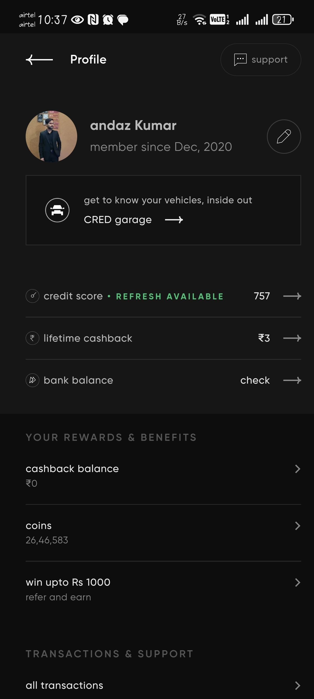

# 🚗 React Native Profile Screen

 <!-- Replace with your actual icon -->


Welcome to the **React Native Profile Screen** project!  
This is a simple and elegant UI screen you can plug into any mobile app requiring user profile functionality.

---

## 🧭 Project Overview

This project is a **Profile UI Screen** built using **React Native** with **Expo**.  
It’s inspired by modern wallet/profile apps like **CRED**, featuring a sleek design and structured layout.

### Features

- 🧑 Profile information (name, avatar, email, etc.)
- 🎁 Rewards and credits summary
- 📃 Transaction history

Use this as a starter template or reference when building similar UIs.

---

## 🖼️ Demo Screenshot

| Profile Screen |
|---------------|
|  |

> 📸 *Screenshot from Expo running on an Android emulator*

---

## 🚀 Getting Started

### Prerequisites

- Node.js (v18+ recommended)
- Expo SDK 50 or later
- npm or yarn

### Installation

```bash
git clone https://github.com/your-username/react-native-profile-screen.git
cd react-native-profile-screen
npm install
````

### Running the App

```bash
npx expo start
```

Scan the QR code with your **Expo Go** app or run the project in a simulator.

---

## 📂 Project Structure

```
.
├── App.js
├── components/
│   └── ProfileScreen.js
├── assets/
│   └── screenshots/
├── package.json
└── README.md
```

---

## 🤝 Contributing

Contributions are welcome and appreciated!

### To contribute:

1. 🍴 Fork this repo
2. 🔧 Create a feature branch: `git checkout -b feature/your-feature`
3. ✅ Commit your changes: `git commit -m "Add feature"`
4. 🚀 Push to your branch: `git push origin feature/your-feature`
5. 🔁 Open a Pull Request and describe your changes

> For more details, consider checking out the [CONTRIBUTING.md](CONTRIBUTING.md) if available.

Please ensure your code follows the existing style and passes all linting/tests.

---

## ⚠️ Notes

* Replace the placeholder app icon with your own.
* Add real screenshots inside `assets/screenshots/`.
* Use `npx expo` instead of `expo-cli` (deprecated).
* Tested on Android & iOS simulators.

---

## 📜 License

This project is licensed under the [MIT License](LICENSE).

```

---
